# git & github 新手教學

## Git 基本工作流程

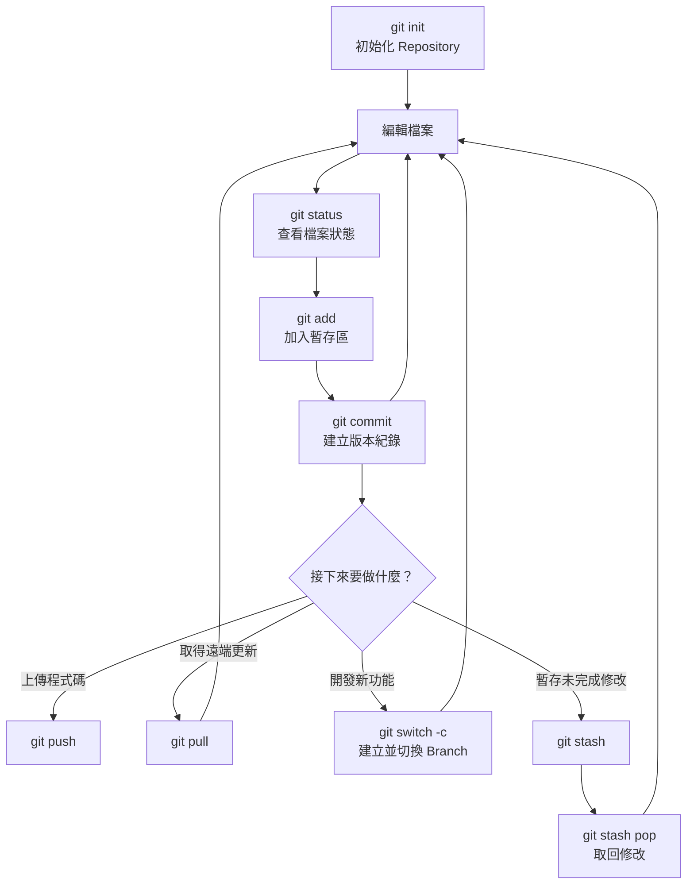

檔案在 Git 中通常會經過以下狀態：

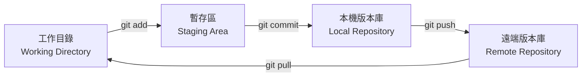


# 1. Git Init

`git init` 會把目前的資料夾初始化成 Git Repository（版本庫），並建立隱藏的 `.git` 目錄，用來保存 Commit、Branch 與設定等版本資訊。

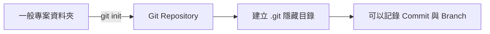

### 初始化目前的資料夾

```sh
git init
```

### 建立新資料夾並初始化

```sh
mkdir my-project
cd my-project
git init
```

### 建立第一個 Commit

```sh
git add .
git commit -m "Initial commit"
```

如果希望主要 Branch 名稱是 `main`，可以使用：

```sh
git branch -M main
```

> `git init` 不會把程式碼上傳到 GitHub；它只是在本機建立 Git Repository。


# 2. Git Add 與 Git Commit

`git add` 會把檔案修改加入暫存區；`git commit` 則會把暫存區中的內容建立成一筆版本紀錄。Commit 只會保存在本機，不會自動上傳到 GitHub。

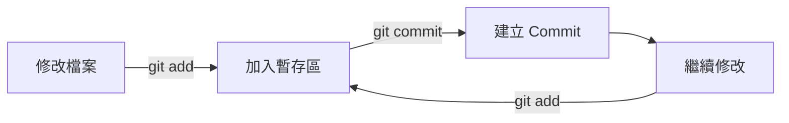

### 查看目前狀態

```sh
git status
```

Git 會顯示哪些檔案尚未追蹤、已修改或已加入暫存區。

### 將指定檔案加入暫存區

```sh
git add README.md
```

### 將目前目錄的所有修改加入暫存區

```sh
git add .
```

### 查看已加入暫存區的修改

```sh
git diff --staged
```

### 建立 Commit

```sh
git commit -m "Add Git tutorial"
```

### 業界常用的 Commit Message 格式

許多團隊會採用 [Conventional Commits](https://www.conventionalcommits.org/zh-hant/v1.0.0/) 格式，讓 Commit 歷史容易閱讀，也方便自動產生 Changelog 與版本號。

基本格式：

```text
<type>(<scope>): <description>
```

- `type`：修改的種類。
- `scope`：選填，指出影響範圍，例如 `auth`、`api`、`readme`。
- `description`：簡短描述做了什麼，避免只寫 `update`、`fix bug` 等模糊訊息。

常用的 Type：

| Type | 用途 | Commit Message 範例 |
| --- | --- | --- |
| `feat` | 新增功能 | `feat(auth): add Google login` |
| `fix` | 修正 Bug | `fix(api): handle empty response` |
| `docs` | 修改文件 | `docs(readme): add Git Flow guide` |
| `style` | 格式調整，不影響程式邏輯 | `style: format source files` |
| `refactor` | 重構程式，不是新增功能或修 Bug | `refactor(user): simplify validation` |
| `perf` | 效能改善 | `perf(db): reduce duplicate queries` |
| `test` | 新增或修改測試 | `test(auth): add login failure cases` |
| `build` | 建置系統或依賴調整 | `build: upgrade Node.js version` |
| `ci` | CI/CD 設定 | `ci: add GitHub Actions workflow` |
| `chore` | 其他維護工作 | `chore: update dependencies` |
| `revert` | 還原先前修改 | `revert: remove Google login` |

實際下指令時：

```sh
git commit -m "feat(auth): add Google login"
git commit -m "fix(api): handle empty response"
git commit -m "docs(readme): add Git Flow guide"
```

### 包含 Body 的 Commit Message

修改原因或影響較複雜時，可以在標題後加入 Body：

```sh
git commit -m "fix(auth): prevent expired token reuse" \
  -m "Clear the cached token after receiving an unauthorized response."
```

### Breaking Change

如果修改與舊版不相容，可以在 Type 後加上 `!`：

```sh
git commit -m "feat(api)!: change user response format"
```

也可以在 Footer 說明破壞性變更：

```text
feat(api): change user response format

BREAKING CHANGE: user.name is replaced by user.profile.displayName
```

### Commit Message 撰寫原則

- 一個 Commit 只處理一個明確目的。
- 使用簡短、具體的動詞描述修改，例如 `add`、`fix`、`remove`、`update`。
- 說明「做了什麼」，必要時在 Body 補充「為什麼要做」。
- 團隊應統一使用相同語言與格式。
- Commit 前先執行 `git diff --staged`，確認沒有混入無關修改。

### 查看 Commit 紀錄

```sh
git log
```

使用單行格式查看較精簡的歷史：

```sh
git log --oneline --graph --all
```

### 修改最近一次 Commit Message

```sh
git commit --amend -m "New commit message"
```

如果只是忘記加入某個檔案，也可以補進最近一次 Commit：

```sh
git add <遺漏的檔案>
git commit --amend --no-edit
```

> `--amend` 會改寫最近一次 Commit。已經 Push 且多人共同使用的 Commit，不建議隨意修改。


# 3. Git Push

`git push` 會把本機 Branch 的 Commit 上傳到遠端 Repository，例如 GitHub。執行前必須先完成 Commit。

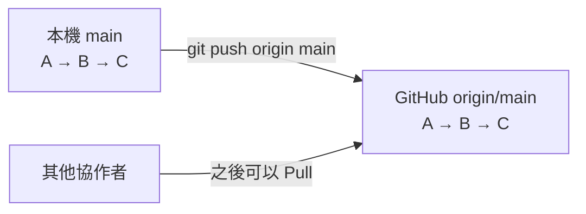

### 查看遠端 Repository

```sh
git remote -v
```

### 第一次設定 GitHub 遠端位置

```sh
git remote add origin https://github.com/USERNAME/REPOSITORY.git
```

### 第一次推送 main Branch

```sh
git push -u origin main
```

`-u` 會讓本機的 `main` 追蹤遠端的 `origin/main`。設定完成後，之後通常只需要：

```sh
git push
```

### 推送指定 Branch

```sh
git push origin feature/login
```

### 刪除遠端 Branch

```sh
git push origin --delete feature/login
```

> 如果遠端已有本機沒有的 Commit，Push 會被拒絕。通常應先執行 `git pull` 整合遠端變更，再重新 Push。


# 4. Git Pull

`git pull` 會從遠端下載最新 Commit，並整合到目前的本機 Branch。它大致等於先執行 `git fetch`，再執行 `git merge`。

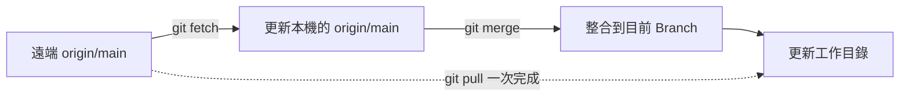

### 拉取目前 Branch 的遠端更新

```sh
git pull
```

### 指定遠端與 Branch

```sh
git pull origin main
```

### 使用 Rebase 方式拉取

```sh
git pull --rebase origin main
```

`--rebase` 會把本機尚未推送的 Commit 接到遠端最新 Commit 之後，讓歷史紀錄較為線性。

### 發生衝突時

先開啟衝突檔案，處理 `<<<<<<<`、`=======`、`>>>>>>>` 標記，再依 Pull 使用的整合方式繼續：

```sh
# 一般 git pull（merge）
git add <衝突檔案>
git commit

# git pull --rebase
git add <衝突檔案>
git rebase --continue
```

想取消 Rebase，可以執行：

```sh
git rebase --abort
```

> Pull 前可先執行 `git status`，確認工作目錄沒有尚未處理的修改。


# 5. Git Branch（開分支）

Branch（分支）可以讓你在不影響主要程式碼的情況下開發新功能或修正問題。完成後，再透過 Merge 或 Rebase 將修改整合回主要 Branch。

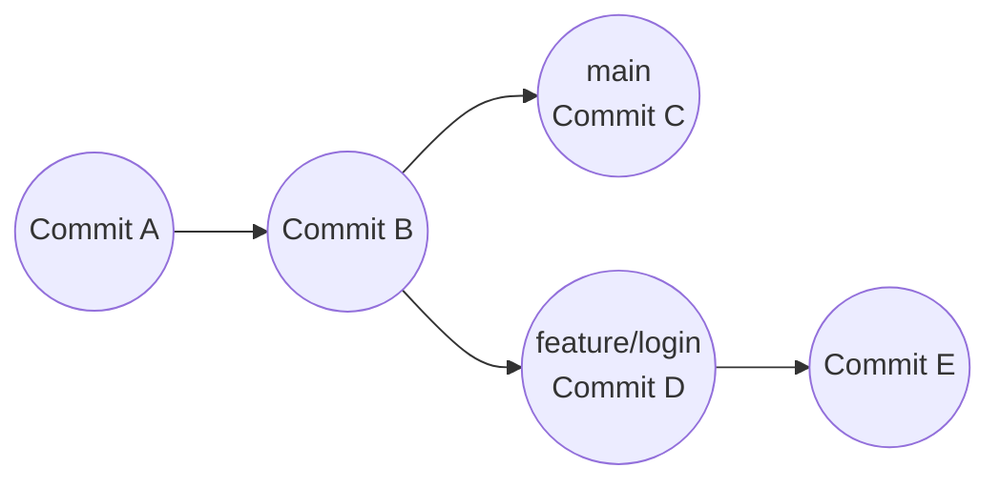

### 查看所有本機 Branch

```sh
git branch
```

目前所在的 Branch 前面會顯示 `*`。

### 建立新 Branch

```sh
git branch feature/login
```

### 切換到指定 Branch

```sh
git switch feature/login
```

舊版 Git 也可以使用：

```sh
git checkout feature/login
```

### 建立並立即切換到新 Branch

```sh
git switch -c feature/login
```

等同於舊版 Git 的：

```sh
git checkout -b feature/login
```

### 將新 Branch 推送到遠端

```sh
git push -u origin feature/login
```

### 刪除本機 Branch

```sh
git branch -d feature/login
```

如果 Branch 尚未合併，但確定要強制刪除：

```sh
git branch -D feature/login
```

> 刪除 Branch 前，必須先切換到其他 Branch，例如 `git switch main`。


# 6. Git Flow（團隊分支流程）

Git Flow 是一種適合「有明確版本發布週期」的分支管理方式。它使用長期存在的 `main`、`develop`，搭配短期的 `feature`、`release` 與 `hotfix` Branch。

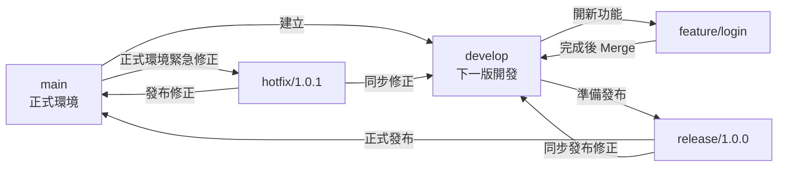

### Branch 用途

| Branch | 用途 | 來源 | 完成後合併到 |
| --- | --- | --- | --- |
| `main` | 正式發布、可部署版本 | — | — |
| `develop` | 整合下一個版本的功能 | `main` | `main`（透過 Release） |
| `feature/*` | 開發單一功能 | `develop` | `develop` |
| `release/*` | 發布前測試、修正與版本調整 | `develop` | `main`、`develop` |
| `hotfix/*` | 緊急修正正式環境問題 | `main` | `main`、`develop` |

### 第一次建立 Develop Branch

```sh
git switch main
git pull origin main
git switch -c develop
git push -u origin develop
```

### Feature 開發流程

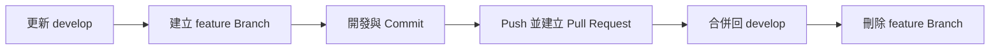

```sh
# 1. 從最新 develop 開分支
git switch develop
git pull origin develop
git switch -c feature/login

# 2. 開發並建立 Commit
git add .
git commit -m "feat(auth): add login page"

# 3. 推送後建立 Pull Request，目標選擇 develop
git push -u origin feature/login

# 4. Pull Request 合併完成後，更新並刪除本機功能分支
git switch develop
git pull origin develop
git branch -d feature/login
```

### Release 發布流程

```sh
# 1. 從 develop 建立 Release Branch
git switch develop
git pull origin develop
git switch -c release/1.0.0

# 2. 完成測試與版本調整後建立 Commit
git add .
git commit -m "chore(release): prepare version 1.0.0"

# 3. 合併到 main 並建立版本 Tag
git switch main
git merge --no-ff release/1.0.0
git tag -a v1.0.0 -m "Release version 1.0.0"

# 4. 將 Release 的修改同步回 develop
git switch develop
git merge --no-ff release/1.0.0

# 5. 推送 Branch 與 Tag，再刪除 Release Branch
git push origin main develop --tags
git branch -d release/1.0.0
```

### Hotfix 緊急修正流程

```sh
# 1. 從正式版 main 建立 Hotfix Branch
git switch main
git pull origin main
git switch -c hotfix/1.0.1

# 2. 修正並 Commit
git add .
git commit -m "fix(auth): prevent login redirect loop"

# 3. 合併到 main 並建立修正版 Tag
git switch main
git merge --no-ff hotfix/1.0.1
git tag -a v1.0.1 -m "Release version 1.0.1"

# 4. 同步修正到 develop
git switch develop
git merge --no-ff hotfix/1.0.1

# 5. 推送並刪除 Hotfix Branch
git push origin main develop --tags
git branch -d hotfix/1.0.1
```

> Git Flow 並非所有專案都必須採用。持續部署的小型 Web 專案通常可使用較簡單的 GitHub Flow；需要維護多個正式版本或有固定發布週期時，Git Flow 會比較合適。參考：[A successful Git branching model](https://nvie.com/posts/a-successful-git-branching-model/)。


# 7. Detached HEAD（脫離 Branch）

Detached HEAD 表示 HEAD 目前直接指向某個 Commit，而不是指向 Branch。這種狀態常用來查看或測試歷史版本，不一定是錯誤。

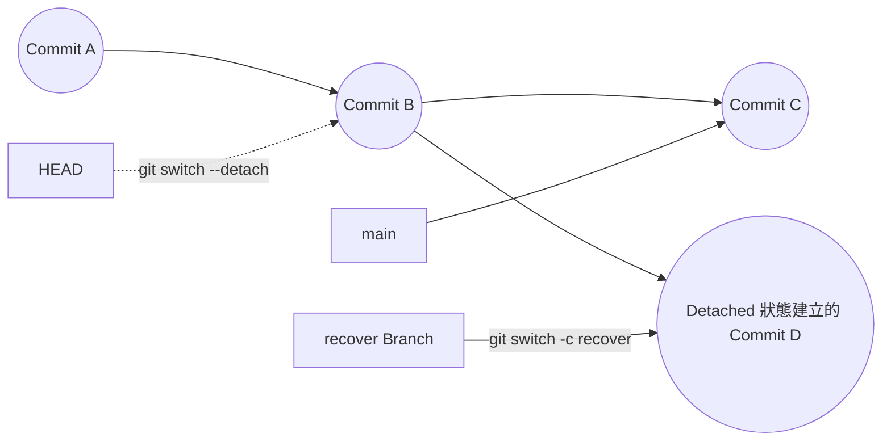

常見用途包括：

- 查看某個歷史版本。
- 測試舊版本是否正常。
- 比較不同 Commit。
- Debug 特定版本的問題。

### 切換到某個歷史 Commit

```sh
git switch --detach <commit-id>
```

查看完成後，可以切回原本的 Branch：

```sh
git switch main
```

如果在 Detached HEAD 狀態建立了 Commit，切換到其他 Branch 後，該 Commit 不會自動隸屬於任何 Branch。可以用 Reflog 找回：

```sh
git reflog
```

再建立一個 Branch 保存該 Commit：

```sh
git branch feature/recover-work-1 <commit-id>
```

或直接建立並切換到新 Branch：

```sh
git switch -c feature/recover-work-1 <commit-id>
```


# 8. Git Cherry Pick

`git cherry-pick` 可以把某一個或多個指定 Commit 的修改，複製到目前所在的 Branch。複製後會產生新的 Commit ID。

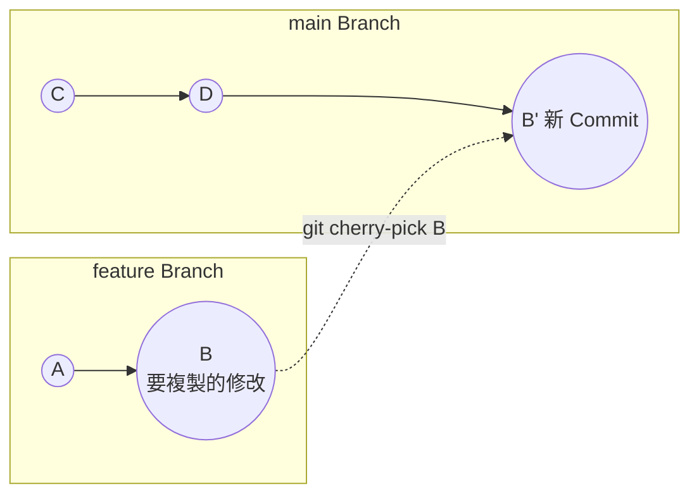

### 複製單一 Commit

```sh
git cherry-pick <commit-id>
```

### 記錄原始 Commit

```sh
git cherry-pick -x <commit-id>
```

`-x` 會在新的 Commit Message 加入原始 Commit 的來源資訊：

```text
(cherry picked from commit 95fc20c0...)
```

### 套用修改但暫時不建立 Commit

```sh
git cherry-pick --no-commit <commit-id>
```

也可以依序套用多個 Commit，最後合併成一個 Commit：

```sh
git cherry-pick --no-commit <commit-a>
git cherry-pick --no-commit <commit-b>
git cherry-pick --no-commit <commit-c>
git commit -m "Combine selected changes"
```

### 發生衝突時

```sh
# 修改衝突檔案後
git add <衝突檔案>
git cherry-pick --continue
```

想取消整個 Cherry Pick，可以執行：

```sh
git cherry-pick --abort
```


# 9. Git Merge

`git merge` 會把另一個 Branch 的歷史整合到目前所在的 Branch。通常會先切換到「要接收變更」的 Branch，再合併來源 Branch。

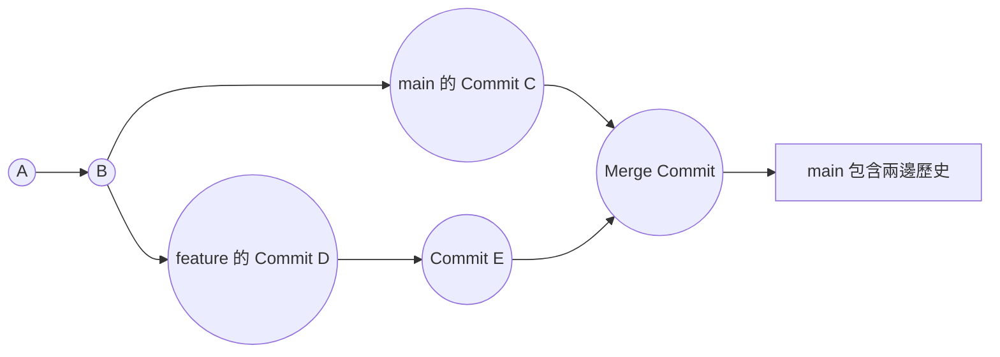

### 把 feature/login 合併進 main

```sh
git switch main
git pull
git merge feature/login
```

如果 Git 可以直接把 Branch 指標往前移動，會產生 Fast-forward；如果兩邊都有新的 Commit，通常會建立一個 Merge Commit。

### 強制建立 Merge Commit

```sh
git merge --no-ff feature/login
```

### 發生衝突時

```sh
# 修改衝突檔案後
git add <衝突檔案>
git commit
```

### 取消尚未完成的 Merge

```sh
git merge --abort
```

合併成功且確認不再需要功能 Branch 後，可刪除本機 Branch：

```sh
git branch -d feature/login
```


# 10. Git Rebase

`git rebase` 會把目前 Branch 的 Commit 暫時取下，接到另一個 Branch 的最新 Commit 後面，再重新套用。它可以讓 Commit 歷史保持線性，但會改寫 Commit ID。

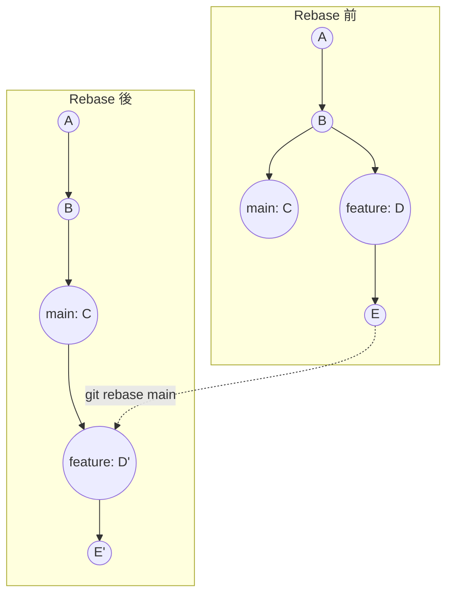

### 把 feature/login 更新到最新 main 之後

```sh
git switch feature/login
git rebase main
```

Rebase 前通常先更新本機的 `main`：

```sh
git switch main
git pull
git switch feature/login
git rebase main
```

### 發生衝突時

```sh
# 修改衝突檔案後
git add <衝突檔案>
git rebase --continue
```

也可以跳過目前無法套用的 Commit，或取消整個 Rebase：

```sh
git rebase --skip
git rebase --abort
```

### 整理最近三個 Commit

```sh
git rebase -i HEAD~3
```

互動式 Rebase 常用選項：

- `pick`：保留 Commit。
- `reword`：修改 Commit Message。
- `squash`：與上一個 Commit 合併，並編輯 Commit Message。
- `fixup`：與上一個 Commit 合併，捨棄目前的 Commit Message。
- `drop`：刪除 Commit。

> 不要隨意 Rebase 已經推送且多人共同使用的 Branch，因為改寫歷史可能造成其他人的 Branch 難以同步。若確定要推送改寫後的個人 Branch，優先使用 `git push --force-with-lease`，不要直接使用 `--force`。


# 11. Git Reset

`git reset` 可以移動目前 Branch 的 HEAD，常用於取消暫存、撤回本機 Commit，或讓檔案回到指定版本。不同模式會保留或刪除不同程度的修改。

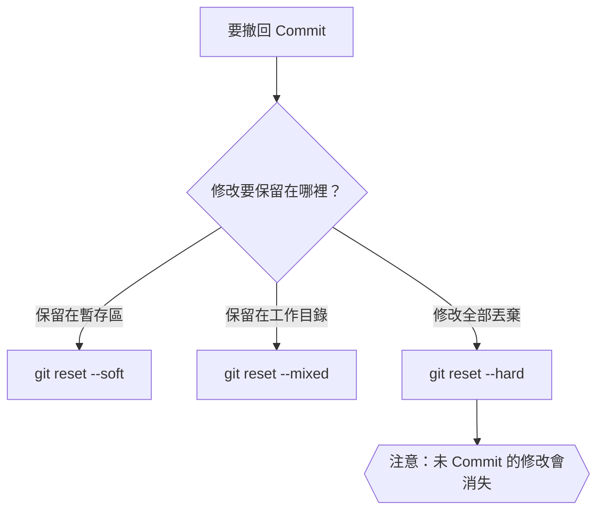

| 模式 | Commit 紀錄 | 暫存區 | 工作目錄 |
| --- | --- | --- | --- |
| `--soft` | 移除 | 保留 | 保留 |
| `--mixed` | 移除 | 取消暫存 | 保留 |
| `--hard` | 移除 | 清除 | 清除 |

### 取消檔案的暫存狀態

```sh
git reset <檔案>
```

較新的 Git 也可以使用語意更清楚的指令：

```sh
git restore --staged <檔案>
```

### 撤回最近一個 Commit，但保留在暫存區

```sh
git reset --soft HEAD~1
```

適合修改 Commit Message，或補進遺漏的檔案後重新 Commit。

### 撤回最近一個 Commit，保留檔案修改但取消暫存

```sh
git reset HEAD~1
```

`--mixed` 是預設模式，所以上面的指令等同於：

```sh
git reset --mixed HEAD~1
```

### 完全丟棄最近一個 Commit 與檔案修改

```sh
git reset --hard HEAD~1
```

### 回到指定 Commit

```sh
git reset --hard <commit-id>
```

> `--hard` 會刪除尚未 Commit 的追蹤檔案修改，執行前務必先用 `git status` 確認。對已推送或多人共用的 Commit，通常應使用 `git revert <commit-id>` 建立反向 Commit，而不是用 Reset 改寫歷史。

如果不小心 Reset，可以先使用 Reflog 尋找原本的 Commit：

```sh
git reflog
git reset --hard <原本的-commit-id>
```

